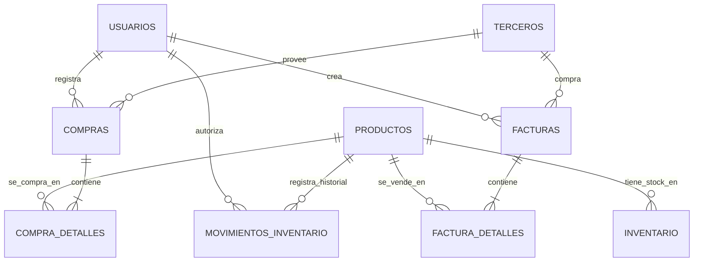

# Flujo de Relaciones de Base de Datos - ERPod

Este documento explica cómo interactúan entre sí las tablas de la base de datos para garantizar la integridad de la información en el sistema ERP.

## Diagrama Visual de Relaciones

## Explicación del Flujo de Datos

### 1. Gestión de Personas (Usuarios y Terceros)
*   **Usuarios:** Son las personas internas de la empresa (Vendedores, Administradores). Son el punto de partida de cualquier acción (crear factura, registrar compra). Cada acción queda marcada con su ID para auditoría.
*   **Terceros:** Son las entidades externas. Un tercero puede ser **Cliente** (compra productos) o **Proveedor** (vende insumos). La tabla unificada permite que una misma empresa sea cliente y proveedor a la vez sin duplicar datos.
*   **Información Empresa:** Una tabla única que guarda los datos del dueño del sistema (Su logo, NIT, Régimen). Estos datos son los que salen impresos en el encabezado de las facturas.

### 2. Ciclo de Ventas (Facturación)
El flujo de una venta conecta 4 tablas principales:
1.  **Factura (Cabecera):** Se crea vinculando un `Tercero` (Cliente) y un `Usuario` (Vendedor). Define *quién* compra y *cuándo*.
2.  **Detalle de Factura:** Por cada producto vendido, se crea un registro aquí. Vincula la `Factura` con el `Producto`.
3.  **Impacto en Inventario:** Al confirmarse la factura, el sistema debe restar automáticamente la cantidad vendida de la tabla `Inventario`.
4.  **Registro Histórico:** Esa resta genera un registro en `Movimientos_Inventario` de tipo 'salida', explicando qué factura causó la baja de stock.

### 3. Ciclo de Compras (Abastecimiento)
Es el espejo del ciclo de ventas:
1.  **Compra (Cabecera):** Vincula un `Tercero` (Proveedor) y el `Usuario` que recibe la mercancía.
2.  **Detalle de Compra:** Lista qué productos entraron y a qué costo.
3.  **Impacto en Inventario:** Suma las cantidades a la tabla `Inventario`.
4.  **Actualización de Costos:** Puede actualizar el costo promedio o último costo en master de `Productos`.

### 4. Control de Inventarios (El Corazón del Sistema)
El inventario no es solo un número, es un rastro auditoriable:
*   **Inventario (Stock):** Solo dice "Hay 10 unidades". Es la foto actual.
*   **Movimientos (Kardex):** Dice "¿Por qué hay 10?".
    *   Ejemplo: "Hubo 0", luego "Entraron 12 por Compra #50", luego "Salieron 2 por Factura #100".
*   **Relación:** `Producto` -> tiene -> `Inventario` -> modificado por -> `Movimientos`.

---
**Nota Técnica:** Todas las relaciones usan claves foráneas (`FOREIGN KEY`). Esto impide, por ejemplo, borrar un producto si ya existen facturas que lo vendieron, garantizando que el historial contable nunca se rompa.
